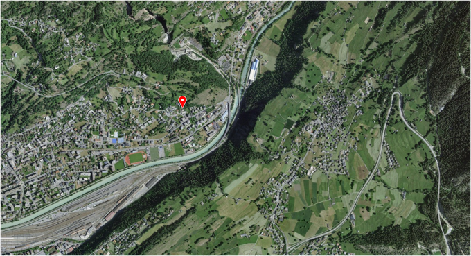
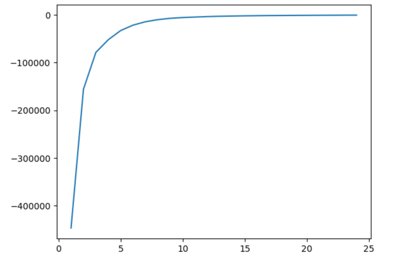

### Research @ SLF (2023-2024)

# Defining weather scenarios by clustering the data

### Introduction
This work has been made during a 6-month internship in the Remote Sensing Team at SLF, Davos

* Author: *Justine Sommerlatt*

After multiple experiments as well as discussions we fixed some values such as: 

* the wind velocity: for the wind velocity we decided to look at the mean value over the last day before the event. If this value exceeds 5m/sec we set a "wind velocity value" to 1: meaning there was enough wind to transport snow (else 0). 
* the humidity: for the humidity we decided to look at the mean value over the last hour
* the radiation: for the radiation we decided to look at the mean value over the last 12 hours 
* the number of stations: for the number of stations, we first tried with only data from one station: this is what is given in the code right now, but we agreed that this makes the clustering too sensitive. The idea now would be to take different stations close to the avalanche to take the data from: this means we can either define a perimeter in which we take all the stations or define n the number of stations we want to use and take the n nearest stations for the data acquisition: this can be done in the *dataset_conversion.py* code.  


### Clone the repository

Clone the repository wherever you'd like to work with.
Simply go where you want to put the project by running this command line in the terminal:
```sh
cd path/to/your/directory
```
Then clone the project and go into the directory:
```sh
git clone https://github.com/justinesommerlatt/Defining-weather-scenarios.git
cd Defining-weather-scenarios
```

Now you have the project on your computer!


### Dependencies
* Python 3 >= 3.5
* PyTorch >= 1.1
* OpenCV >= 3.4
* Matplotlib >= 3.1
* NumPy >= 1.18
* Anaconda for Python 

Simply run the following command:
```sh
pip3 install numpy opencv-python torch matplotlib
```

Before going further, make sure you have anaconda on your computer. If no, you can download it here: https://www.anaconda.com/download

Then, connect your computer to the intra network (use SLF computer or connect via VPN).


### Contents
There are two python scripts in this repo:

1. `dataset_conversion.py` 
2. `dataset_generation.py`

and one jupyter script: 

`Excel_table_clustering_code_using_K-Means_in_Python.ipynb`


### Download the datasets

Before running the code, you need to download datasets and put them in the folder with your project:
1. the dataset with all the IMIS : *stations.csv* available here: https://measurement-data.slf.ch/imis/
2. the dataset with the observed avalanches : *dataForAvalancheSizeModelDevelopment.csv* available here: https://envidat.ch/#/metadata/avalanche-prediction-snowpack-simulations


### Prepare the data 
The dataset that provides avalanches is based on observations and thus has outliers where people didn't know the location of the avalanches, put their location instead of the avalanche's location.. (see example)




Therefore, the dataset must first be cleaned of outliers. This can be made using filters on QGIS or by checking the location of avalanches on https://map.geo.admin.ch 

Now you can run this command line:

```sh 
python dataset_conversion.py
```

This code will take the stations dataset as well with the avalanches dataset and calculate which station is the nearest to each avalanche and put these information in a new dataset (.xls file) which will look like: 

```txt
triggerDateTime     coordX      coordY      startZoneElevation      startZoneAspect     fractureThicknessMean   size    lat     lon IMIScode    IMISlat     IMISlon
```
with : 
* *triggerDateTime* : date and the time when the avalanche happened
* *coordX* : X coordinate the avalanche
* *coordY* : Y coordinate of the avalanche
* *startZoneElevation* : elevation of the starting zone of the avalanche 
* *startZoneAspect*: orientation of the starting zone of the avalanche
* *fractureThicknessMean*: fracture thickness mean of the avalanche
* *size*: size of the avalanche
* *lat*: latitude of the avalanche
* *lon*: longitude of the avalanche
* *IMIScode*: code of the nearest IMIS
* *IMISlat*: latitude of the nearest IMIS
* *IMISlon*: longitude of the nearest IMIS

You need to convert this Excel file into a csv file to continue.

Now run the following command line: 

```sh 
python dataset_generation.py
```

This will make requests to the data warehouse (https://dwh.int.slf.ch) for each avalanche with parameters such as time, date and nearest station of the avalanche, so you can have the IMIS information from that event. We decided to always take the measure took before the event, except when it's HH:30 then we take the measurement at the exact same time as the avalanche.

This code will generate a new Excel file with the information from the IMIS for each avalanche which will have new parameters:
* *measure_date*: measure date of the values
* *hyear*: hydrological year
* *VW_30MIN_MEAN*: wind speed, vectorial mean over last 30 minutes 
* *VW_30MIN_MAX*: wind speed, max 5sec measurement within last 30 minutes 
* *DW_30MIN_MEAN*: wind direction, vectorial mean over last 30 minutes
* *TA_30MIN_MEAN*: air temperature, mean over last 30 minutes
* *RH_30MIN_MEAN*: relative humidity, mean over last 30 minutes
* *RSWR_30MIN_MEAN*: reflected short wave radiation, mean over last 30 minutes
* *HS*: height of snowpack, total thickness of snowpack, instantaneous
* *TS0_30MIN_MEAN*: snow temperature at the ground, mean over last 30 minutes
* *TS25_30MIN_MEAN*: snow temperature at 25cm above the ground, mean over last 30 minutes
* *TS50_30MIN_MEAN*: snow temperature at 50cm above the ground, mean over last 30 minutes
* *TS100_30MIN_MEAN*: snow temperature at 100cm above the ground, mean over last 30 minutes
* *TSS_30MIN_MEAN*: snow surface temperature, mean over last 30 minutes
* *DW_30MIN_SD*: wind direction, standard deviation over last 30min
* *HN_1D*: height of snow during last 24 hours
* *HN_12H*: height of snow during last 12 hours
* *HN_6H*: height of snow during last 6 hours 
* *RSWR_30MIN_MEAN_12H*: average radiation value over the last 12 hours 
* *RH_30MIN_MEAN_1H*: average humidity value over the last hour
* *VW_30MIN_MEAN_1D*: average wind velocity value over the last 24 hours
* *VW_VALUE*: wind velocity value (0 or 1) depending on whether the average over last 24 hours (VW_30MIN_MEAN_1D) exceeds the set threshold 


### Clustering the avalanches to get weather scenarios

Now you have all information needed for each avalanche in the same dataset as the avalanches. Next step is to do the clustering on it: you can remove the parameters you don't want to use in the clustering or tell the code which parameters you want to ignore.
Run the code *Excel_table_clustering_code_using_K-Means_in_Python.ipynb* on jupyter notebook by using the dataset generated by *dataset_generation.py*. 


First, save the Excel file as a *.csv file. At the start menu select the Anaconda prompt and then go to the directory were you have your csv file and code file and start the Jupyter notebooks.
In the program, you have to change the name of the input file, to the CSV file: now you can execute all the cells.
At the end of the code you will get a graph like this: 



The purpose of this graph is to help you choose how many clusters you should make (because K-Means algorithm needs to know how many clusters it has to define). 
You can try different values for the number of clusters but this graph helps you find the more relevant number by choosing the value where the curve changes its slope.
In the example above it would be 4 clusters. 

Once you ran the code and defined the right number of clusters, change this parameter in the code and run it again. The code will generate a new .csv file based on the same dataset you gave in entry but with a new column given the cluster id of each avalanche. Open the file in Excel and apply a filter on the new column data to see the elements of the separate clusters.
Now you can do all the analysis you need. 


